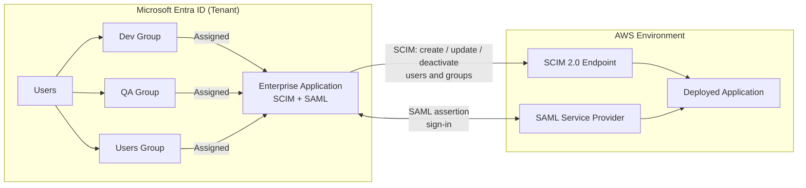
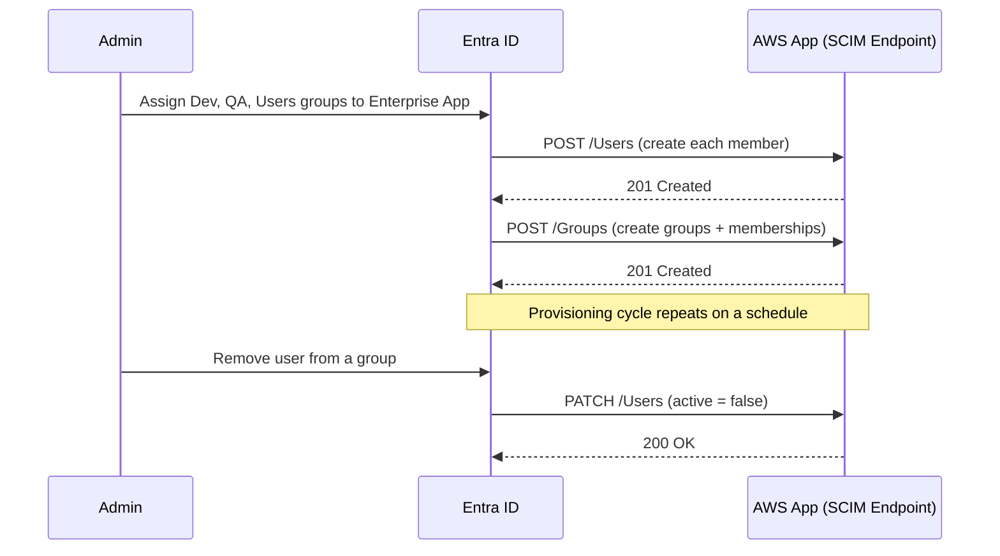
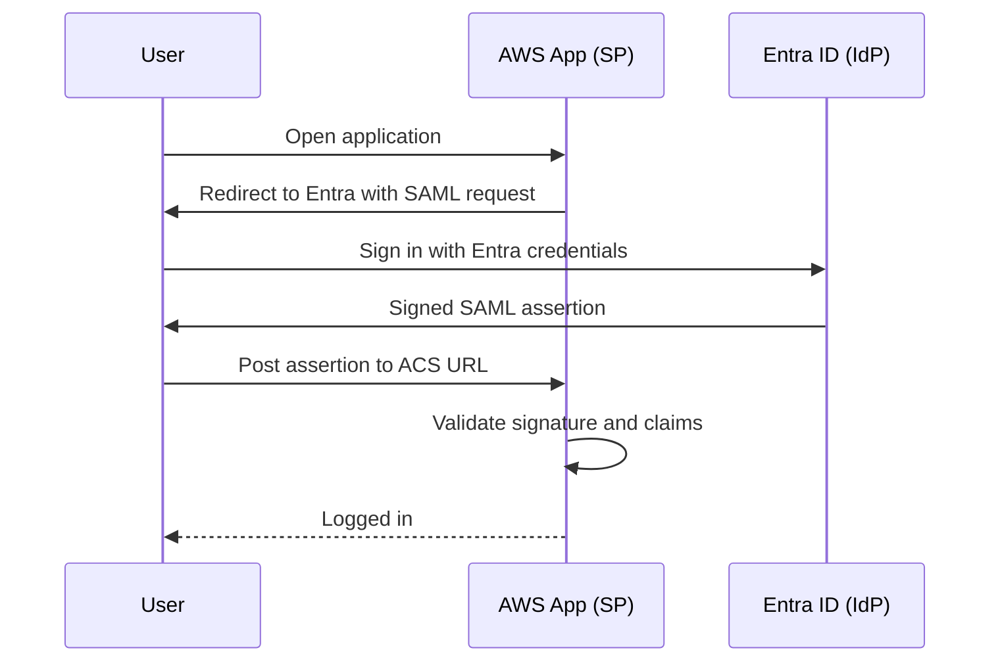

# Entra ID → AWS: SCIM Provisioning + SAML SSO Lab

A hands-on identity lab that connects an application running in AWS to Microsoft Entra ID (Azure AD). Users and groups created in Entra are automatically provisioned into the application with **SCIM 2.0**, and those same users sign in with their Entra credentials through **SAML 2.0 single sign-on**.

The goal was simple: manage access in one place. Add someone to a group in Entra, and they show up in the app with the right access. Remove them, and their access goes away. No separate accounts, no separate passwords.

---

## Architecture

Entra is the **identity provider (IdP)** and the single source of truth. The AWS-hosted app is the **service provider (SP)** that trusts Entra for both who exists (SCIM) and who is signing in (SAML).

---

## What I Built

### 1. Group-based access in Entra ID

I created three security groups in my Entra tenant and added members to each. Access to the application is driven entirely by group membership rather than individual assignments.

| Entra Group | Members | Purpose |
|---|---|---|
| Dev | Developer accounts | Development team access |
| QA | QA/tester accounts | Testing team access |
| Users | Standard user accounts | General application access |

### 2. SCIM 2.0 automatic provisioning

I set up an Enterprise Application in Entra and configured automatic provisioning to the application's SCIM endpoint in AWS. After assigning the three groups to the app, Entra pushed every group and every member across automatically.

**Result:** all members of the Dev, QA, and Users groups appeared in the AWS side with their group memberships intact, without creating a single account by hand.

### 3. SAML 2.0 single sign-on

To let provisioned users actually log in, I configured SAML SSO between the two sides:

1. Downloaded the **SAML metadata file** from the AWS application.
2. Uploaded it into the Entra Enterprise Application's SAML configuration, which filled in the Entity ID and Reply (ACS) URL.
3. Configured the user attributes and claims sent in the SAML assertion.
4. Shared Entra's federation metadata back with the application so it trusts Entra as its IdP.

**Result:** users sign in to the AWS-hosted app with their existing Entra username and password.

---

## How SCIM and SAML Work Together

Think of it like a building with a front desk. **SCIM** is HR sending the front desk an updated employee list every time someone joins or leaves. **SAML** is the badge check at the door, confirming the person walking in is who they say they are. You need both: the list tells the building who belongs, and the badge proves it at the moment of entry.

| | SCIM 2.0 | SAML 2.0 |
|---|---|---|
| Answers | *Who should have an account?* | *Is this really them?* |
| Direction | Entra pushes to the app | Browser-based redirect exchange |
| When it runs | On a provisioning schedule | Every sign-in |
| Handles | Create, update, deactivate users and groups | Authentication |

---

## Testing and Validation

- [x] Assigned Dev, QA, and Users groups to the Enterprise Application
- [x] Confirmed users and groups appeared in the AWS app after the provisioning cycle
- [x] Reviewed Entra provisioning logs for successful create operations
- [x] Signed in as a provisioned user through SAML SSO
- [x] Removed a user from a group and confirmed the change synced to the app

---

## Skills Demonstrated

Identity federation with SAML 2.0, automated user lifecycle management with SCIM 2.0, group-based access control in Microsoft Entra ID, Enterprise Application configuration, and integrating a cloud-hosted AWS application with a centralized identity provider.

---

## Author

**[Fyzur Rahman]** — Identity Security Consultant
[LinkedIn](#) - https://www.linkedin.com/in/fyzur-rahman/
